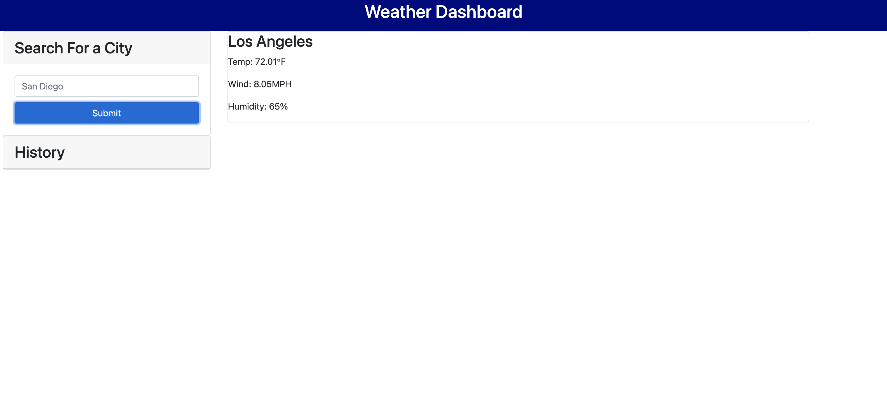

# weather-dashboard

## Description

The goal of this project was to create a website for users (such as travelers) who want to use a weather app to check the forecast in various cities. My motivation was to create an easy user-experience in order to check the current weather and upcoming weather of most cities, and save that information to their computers. I built this site from scratch, and while still not completed, I have learned a lot. In addition to the usual HTML, CSS, and JavaScript techologies, I used Bootstrap to help me with styling. The main goal of the porject was to learn how to use APIs. While I did learn a lot about them, I still don't fully understand them. 

## Active Link:

## Technology Used:
1. HTML
2. CSS
3. JavaScript
4. Bootstrap

## Screenshots:

